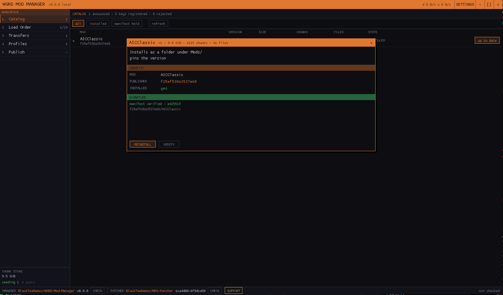
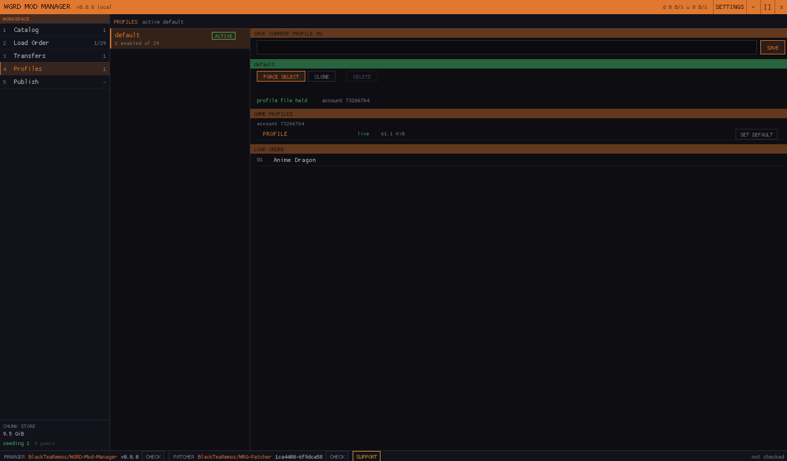

# WGRD Mod Manager

A signed, peer to peer mod manager for Wargame: Red Dragon.



## What it does

**Distributes mods peer to peer**
Releases move over BitTorrent v2 between players.

**Only downloads what changed**
No longer redownloading 9gb of data every update, or obscure replacement.

**Mod makers verified by cryptography**
Every single release signed and goes through signature registry, allowing secure update, while also maintaining ease of updating mods.


**Manages enabled mods**
Multiple mods can be enabled, if they support it, and users can quickly switch between mods they play without reinstalling.

**Manages profiles**
So you no longer loose which profile goes with which mod or pack, and keep all your decks with them.



**All in one installer**
Fetches and installs everything it needs with simplicity in mind, including [WRG-Patcher](https://github.com/BlackTeaRemos/WRG-Patcher), the proxy DLL that makes the game load mods at all.

**Updates itself**
Checks its own releases and swaps the executable in place.

## Installing

Drop `wgrd-mod-manager.exe` into your Wargame: Red Dragon folder, beside `WarGame3.exe`, and run it.

## Publishing a mod

1. CREATE KEY in the Publish tab, choosing where to store it
2. Submit `keys/<fingerprint>.json` to the [signature registry](https://github.com/BlackTeaRemos/WGRD-Mod-Manager-Signatures), contact @BlackTeaRemos on Discord for approval steps, at https://discord.gg/tMDWaBqSsu. Can be done only once, after approval, mods can be signed with key.
3. Pick your mod folder, unlock the key, SIGN AND ANNOUNCE

Your key file stays on your machine.

## Building

C++26, MSVC, CMake, Ninja, vcpkg.
Windows only, x64.

```powershell
. ./scripts/Enter-BuildEnvironment.ps1
cmake --preset windows-release
cmake --build --preset windows-release
```

Copy `scripts/ToolchainPaths.local.ps1.example` to `scripts/ToolchainPaths.local.ps1` and point it at your tools first.

## Licence

GNU General Public License, version 3.
See [LICENSE](LICENSE).

Contributions are accepted under the [Contributor License Agreement](CLA.md).
You are granting us a non-revocable license to the work you submit. Make sure you agree with it.

Third party components and their licences are listed in [THIRD-PARTY.md](THIRD-PARTY.md).
